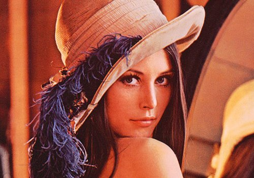
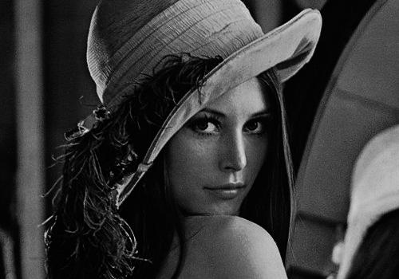

[TOC]


# 图像的数组表示

## 图像的RGB色彩模式

图像中的每个像素点由红(R)，绿(G)，蓝(B)叠加组成：

+ R红色，取值范围，0-255
+ G绿色，取值范围，0-255
+ B蓝色，取值范围，0-255

RGB形成的颜色包括了人类视力所能感知的所有颜色，所以在计算机中，一般的图片都采用RGB色彩


## `PIL`库

`PIL`，Python Image Library

`PIL`库是一个具有强大图像处理能力的第三方库

在命令行下的安装方法：`pip install pillow`

这里需要注意，在安装的时候，库的名称是`pillow`而在实际使用的时候，需要调用`PIL`库


### 使用`PIL`库

```python
>>> from PIL import Image
```

`Image`类是`PIL`库中代表一个图像的类（对象），一个`Image`对象就代表一个图像


## 图像的数组表示

图像是一个由像素组成的二维矩阵，每个元素是一个RGB值

在RGB中每一个元素是一个字节，共有3个字节，因此，一个图像是由3个字节作为元素形成的一个二维矩阵

可以使用`NumPy`的数组来表示图像

使用`Image`对象来表示图像，使用`NumPy`的数组来表示图像中的每一个元素


### 例子

```python
>>> from PIL import Image
>>> import numpy as np
>>> im = np.array(Image.open("E:/Notes/PythonDataAnalysis/01 第一周 数据分析之表示/单元3：实例1：图像的手绘效果/Lenna.jpg"))

>>> print(im.shape, im.dtype)
(350, 500, 3) uint8
```

从返回的结果可以看到，一个图像是一个三位数组，维度分别是高度、宽度和像素RGB值

在第三维度RGB值上，有三个元素，也就是R、G、B分别由一个`uint8`类型来表示

```python
>>> im
array([[[115,  35,  24],
        [127,  47,  36],
        [123,  43,  34],
        ...,
        [211, 125,  90],
        [213, 127,  92],
        [213, 127,  92]],

       ...,

       [[ 33,  17,  20],
        [ 40,  24,  27],
        [ 41,  22,  24],
        ...,
        [ 54,  25,  27],
        [ 58,  29,  31],
        [ 62,  33,  35]]], dtype=uint8)
```


****

# 图像的变换

## 流程

读入图像后，获取像素RGB值，修改后保存为新的文件

## 例子

### 实例1：反色显示

```python
>>> from PIL import Image
>>> import numpy as np
>>> a = np.array(Image.open("E:/Notes/PythonDataAnalysis/01 第一周 数据分析之表示/单元3：实例1：图像的手绘效果/Lenna.jpg"))
>>> print(a.shape, a.dtype) 
(350, 500, 3) uint8		# 3维数组，图像的高度、宽度和RGB值

>>> b = [255, 255, 255] - a		# 计算RGB的补值
>>> im = Image.fromarray(b.astype('uint8'))
>>> im.save("E:/Notes/PythonDataAnalysis/01 第一周 数据分析之表示/单元3：实例1：图像的手绘效果/Lenna1.jpg")
```

<center class="half">
    
    
</center>


### 实例2：灰度取反

```python
>>> from PIL import Image
>>> import numpy as np
>>> a = np.array(Image.open("E:/Notes/PythonDataAnalysis/01 第一周 数据分析之表示/单元3：实例1：图像的手绘效果/Lenna.jpg").convert('L')) 
# 变成灰度图片，保存成一个二维数组，每个值都对应灰度值
>>> print(a.shape, a.dtype) 
(350, 500) uint8

>>> b = 255 - a	# 对灰度值取反
>>> im = Image.fromarray(b.astype('uint8')) 	# 保存为图片
>>> im.save("E:/Notes/PythonDataAnalysis/01 第一周 数据分析之表示/单元3：实例1：图像的手绘效果/Lenna2.jpg")
```

<center class="half">
    
    
</center>


### 实例3：区间变换

```python
>>> from PIL import Image
>>> import numpy as np
>>> a = np.array(Image.open("E:/Notes/PythonDataAnalysis/01 第一周 数据分析之表示/单元3：实例1：图像的手绘效果/Lenna.jpg").convert('L')) 
>>> print(a.shape, a.dtype) 
(350, 500) uint8

>>> c = (100/255)*a + 150	# 区间变换，区间压缩灰度值，再加上150的灰度值，扩充区间范围
>>> im = Image.fromarray(c.astype('uint8')) 	
>>> im.save("E:/Notes/PythonDataAnalysis/01 第一周 数据分析之表示/单元3：实例1：图像的手绘效果/Lenna3.jpg")
```

<center class="half">
    
    
</center>


### 实例4：像素平方

```python
>>> from PIL import Image
>>> import numpy as np
>>> a = np.array(Image.open("E:/Notes/PythonDataAnalysis/01 第一周 数据分析之表示/单元3：实例1：图像的手绘效果/Lenna.jpg").convert('L')) 
>>> print(a.shape, a.dtype) 
(350, 500) uint8

>>> d = 255*(a/255)**2 	# 像素平方，效果是把暗的地方调得更暗
>>> im = Image.fromarray(d.astype('uint8')) 	
>>> im.save("E:/Notes/PythonDataAnalysis/01 第一周 数据分析之表示/单元3：实例1：图像的手绘效果/Lenna4.jpg")
```

<center class="half">
    
    
</center>


****

# “图像的手绘效果”实例分析

## 分析图像手绘效果的特点

+ 手绘图通常是黑白灰的图片
+ 边界线条较重，轮廓部分
+ 相同或相近色彩偏白色，蓝天白云，蓝天部分是白色
+ 手绘效果略有光源效果


## “手绘效果”代码

```python
from PIL import Image
import numpy as np


a = np.array(Image.open("E:/Notes/PythonDataAnalysis/01 第一周 数据分析之表示/单元3：实例1：图像的手绘效果/Lenna.jpg").convert('L').astype('float')) 

depth = 10.						
grad = np.gradient(a)			
grad_x, grad_y = grad			
grad_x = grad_x*depth/100.
grad_y = grad_y*depth/100.

vec_el = np.pi/2.2
vec_az = np.pi/4.
dx = np.cos(vec_el)*np.cos(vec_az)
dy = np.cos(vec_el)*np.sin(vec_az)
dz = np.sin(vec_el)

A = np.sqrt(grad_x**2 + grad_y**2 + 1.)
uni_x = grad_x/A
uni_y = grad_y/A
uni_z = 1./A

b = 255*(dx*uni_x + dy*uni_y + dz*uni_z)
b = b.clip(0,255)

im = Image.fromarray(d.astype('uint8')) 	
im.save("E:/Notes/PythonDataAnalysis/01 第一周 数据分析之表示/单元3：实例1：图像的手绘效果/手绘Lenna.jpg")
```


## 代码分析

参考`https://www.cnblogs.com/ssyfj/p/9291833.html`


### 打开原图片

```python
a = np.array(Image.open("E:/Notes/PythonDataAnalysis/01 第一周 数据分析之表示/单元3：实例1：图像的手绘效果/Lenna.jpg").convert('L').astype('float')) 
```

把图片打开，把原图片的RGB值转换成灰度值，用浮点数表示


### 重构梯度

利用像素之间的梯度值和虚拟深度值对图像进行重构，根据灰度变化来模拟人类视觉的远近程度

使用虚拟深度，表示对于像素灰度变化值的敏感程度：

+ 越小手绘的笔划越浅

+ 越大表明对于梯度变化越敏感，使得图像笔划变重变黑


```python
depth = 0.1
```

设定虚拟深度


```python
grad = np.gradient(a)	
```

取图像的梯度值，由于a是二维数组，所以梯度含行列两个方向的值


```python
grad_x, grad_y = grad
grad_x = grad_x*depth
grad_y = grad_y*depth
```

提取x和y方向上的梯度值

并根据深度调整x、y方向上的梯度值


### 加入光源效果

<center class="half">
    
</center>

+ 设计一个位于图像斜上方的虚拟光源
+ 光源想到对于图像的俯视角称为“Elevation”，方位角称为“Azimuth”
+ 建立光源对各点梯度值的影响函数
+ 运算出各点的新像素值


#### 设置俯视角和方位角

俯视角的设置会影响图像的黑白表现：

+ 如果接近90°，轮廓是黑色，其余地方是白色
+ 如果角度越低，轮廓变白，其余地方变黑
+ 如果取到-90°，画面全黑，相当于从图像的背面进行光照

方位角的设置会影响图像的阴影方位：

+ 取值范围可以是±pi
+ 改变方位角可以感受到光源的位置


```python
vec_el = np.pi/2.2
```

光源的俯视角度（"Elevation"），弧度值（ pi/2.2）

```py
vec_az = np.pi/4.
```

光源的方位角度（"Azimuth"），弧度值（pi/4）


#### 光源对x轴的影响

```
dx = np.cos(vec_el)*np.cos(vec_az) 
```

cos&ang;`俯视角`&times;cos&ang;`方位角`

#### 光源对y轴的影响

```python
dy = np.cos(vec_el)*np.sin(vec_az)
```

cos&ang;`俯视角`&times;cos&ang;`方位角`

#### 光源对z轴的影响

```python
dz = np.sin(vec_el)
```

 cos&ang;`俯视角`


### 梯度值归一化

构造x和y轴梯度的三维归一化单位坐标系：

+ 梯度值的信息代表原图像的信息，由于加入了光源的影响，所以要把梯度值从二维平面转化成三维

+ 同时需要对梯度进行归一化处理，方便计算


```python
A = np.sqrt(grad_x**2 + grad_y**2 + 1.)
```

求梯度之间的距离，设定z轴的值的平方为1.

求距离对于二维的情况就是&radic;(x<sup>2</sup>+y<sup>2</sup>)，三维就是&radic;(x<sup>2</sup>+y<sup>2</sup>+z<sup>2</sup>)，这里z<sup>2 </sup>= 1.（用浮点数表示）


```python
uni_x = grad_x/A　　
uni_y = grad_y/A　　
uni_z = 1./A　　
```

把梯度值对于三维的距离做归一化处理（z轴的梯度值设为1.）


```python
b = 255*(dx*uni_x + dy*uni_y + dz*uni_z)
```

归一化后的梯度（`unix_x`等）表示原图像的信息，`dx`等表示光源的信息

`dx*uni_x`表示光源作用到原图像之后的新图像信息

由于所有的梯度值都是归一化之后的，所以要乘255


### 图像生成

```python
b = b.clip(0,255)
```

避免数据越界，将生成的灰度值裁剪至0-255区间

```python
im = Image.fromarray(d.astype('uint8')) 	
im.save("E:/Notes/PythonDataAnalysis/01 第一周 数据分析之表示/单元3：实例1：图像的手绘效果/手绘Lenna.jpg")
```

保存图片


## 效果


****


